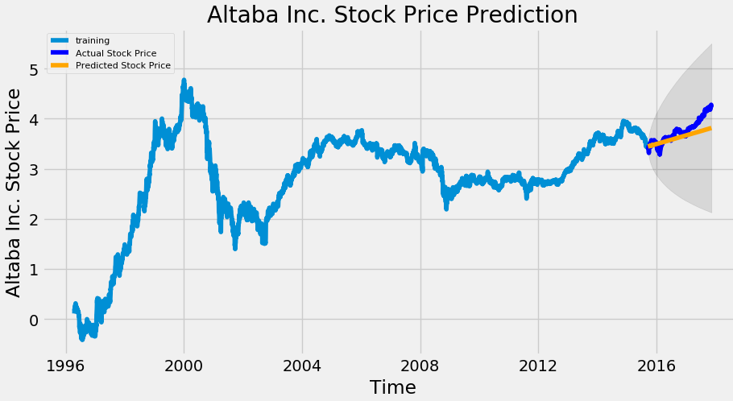
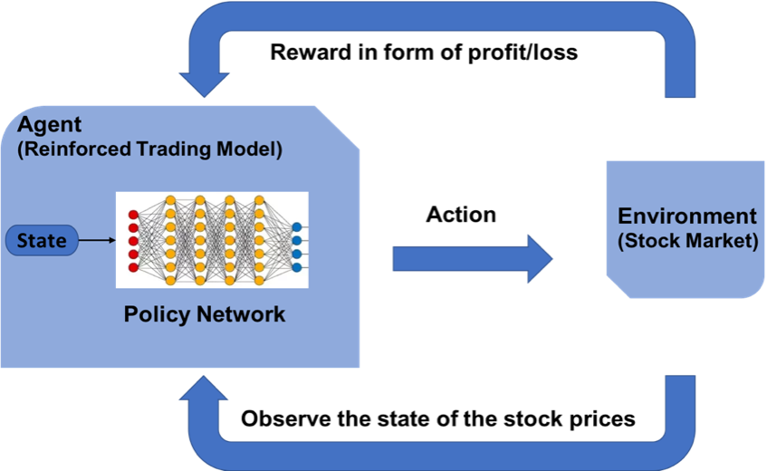
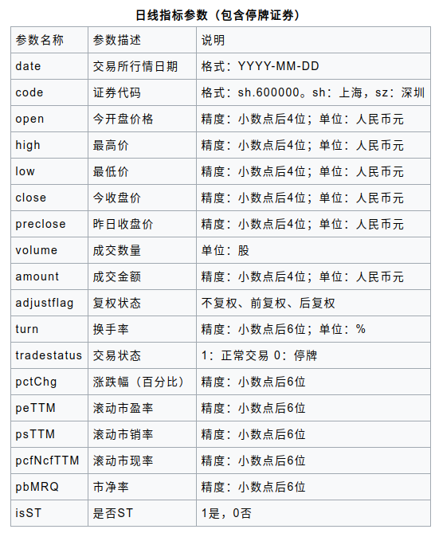

# 强化学习模拟股票交易

最近一段时间，

## 前言


## 监督学习与强化学习的区别

监督学习（如 LSTM）可以根据各种历史数据来预测未来的股票的价格，判断股票是涨还是跌，帮助人做决策。



强化学习是机器学习的另一个分支，在决策的时候采取合适的行动 (Action) 使最后的奖励最大化。与监督学习预测将来的数值不同，强化学习根据输入的状态（如当日开盘价、收盘价等），输出系列动作（例如：买进、持有、卖出）实现自动交易。



## OpenAI Gym 股票交易环境

### 观测 Observation



### 动作 Action

假设交易共有**买入**、**卖出**和**保持** 3 种操作，故定义动作(`action`)为长度为 2 的数组

- `action[0]` 为操作类型；
- `action[1]` 表示买入或卖出百分比；

| 动作类型 `action[0]` | 说明 |
|---|---|
| 1 | 买入 `action[1]`|
| 2 | 卖出 `action[1]`|
| 3 | 保持 |

注意，当动作类型 `action[0] = 3` 时，表示不买也不抛售股票，此时 `action[1]` 的值无实际意义，网络在训练过程中，Agent 会慢慢学习到这一信息。

### 奖励 Reward

奖励函数的设计，对强化学习的目标至关重要。在股票交易的环境下，最应该关心的就是当前的盈利情况，故用当前的利润作为奖励函数。即`当前本金 + 股票价值 - 初始本金 = 利润`。

```python
# profits
reward = self.net_worth - INITIAL_ACCOUNT_BALANCE
reward = 1 if reward > 0 else reward = -100
```

为了使网络更快学习到盈利的策略，当利润为负值时，给予网络一个较大的惩罚 (`-100`)。

## 模拟实验

### 股票数据获取

股票证券数据集来自于 [baostock](http://baostock.com/baostock/index.php/%E9%A6%96%E9%A1%B5)，一个免费、开源的证券数据平台，提供 Python API。

```bash
>> pip install baostock -i https://pypi.tuna.tsinghua.edu.cn/simple/ --trusted-host pypi.tuna.tsinghua.edu.cn
```

数据获取代码参考 [get_stock_data.py](https://github.com/wangshub/RL-Stock/blob/master/get_data.py)

```python
>> python get_stock_data.py
```

将过去 20 多年的股票数据划分为训练集，和末尾 1 个月数据作为测试集，来验证强化学习策略的有效性。划分如下

| `1990-01-01` ~ `2019-11-29` | `2019-12-01` ~ `2019-12-31` |
|---|---|
| 训练集 | 测试集 |

### 验证结果

## 结语

## 参考资料
